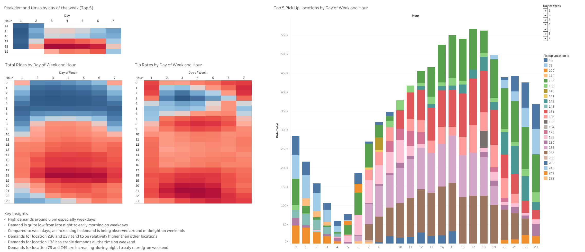

# NYC Taxi Analysis

---

## Business Task
This project analyzes NYC Taxi data to compare day of week, hour and locations. 
The goal for this analysis is to identify demands for taxi by many conditions and provide insights for marketing strategies aimed at improving dispatch efficiency.

---

## Data source
- **new_york-taxi_trips.tlc_yellow_trips_2022**  [BigQuery](bigquery-public-data.new_york_taxi_trips.tlc_yellow_trips_2022)

---

##  Tools Used
- **Google BigQuery**: Data cleaning, transformation, and analysis using SQL
- **Tableau**: Data visualization and dashboard creation
- **GitHub**: Version control and portfolio hosting

---

## Data Range
- 2001_01_01 - 2023_04_18
- total rows: 36,256,539

---

## Cleaning Rules
- fare_amount < 1 and fare_amount > 200 : Invalid data
- trip_distance = 0 : No actual trip
- tip-amount < 0 : Input error


## Key Insights
-  High demands around 6 pm especially weekdays
-  Demand is quite low from late night to early morning on weekdays
-  Compared to weekdays, an increasing in demand is being observed around midmight on weekends


## Suggestions
- **Late Night Rate (Only Friday to Sunday)** : Increase basic ride rate between 10pm - 2am for the high demand on weekend
- **Monitor standby taxi** : Always dispatch vehicles to ensure at least one standby vehicle is available at location 236 and 237
- **Reservation System** : Decrease standby taxi from late night to early morning on weekdays, implement reservation system

##  Dashboard
- Sample Visual
  
- Tableau Public
  [nyc_taxi_Dashboard](https://public.tableau.com/views/NYC_17570045665680/Dashboard1?:language=en-US&:sid=&:redirect=auth&:display_count=n&:origin=viz_share_link)

---

## Repository Structure
```
nyc_taxi_project/
├─ sql/
│   ├─ nyc_heatmap.sql
│   └─ nyc_tiprate.sql
├─ analysis_results/
│   ├─ report.md
│   └─ img/
│       ├─ heatmap_trips.png
│       └─ heatmap_tiprate.png
└─ README.md
```

---

##  Contact
Created by Asuka Osuki – [LinkedIn](www.linkedin.com/in/asuka-osuki-24958b32b) 

